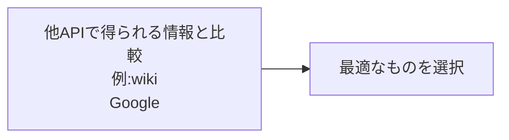
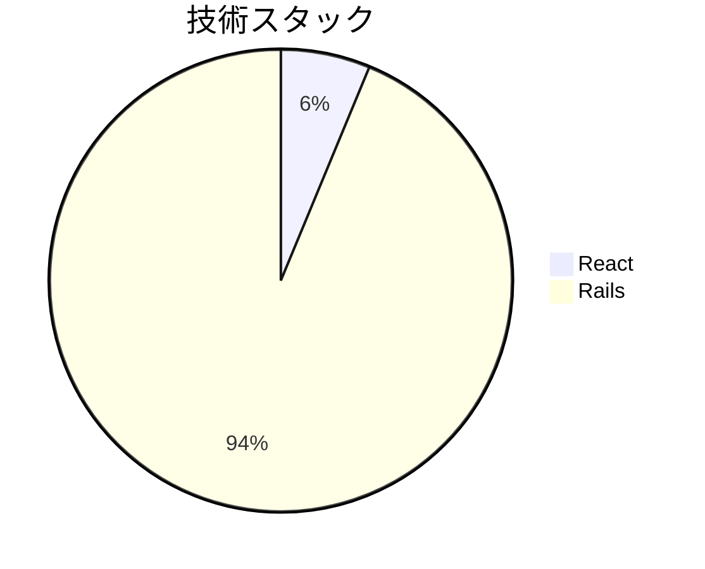
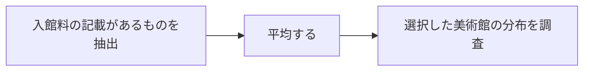

# 美術館データについて
美術館データの骨子は固めなければならない

# 現況
## カラム一覧
```
"name"
"location"
"created_at"
"updated_at"
"business_hours"
"admission_fees"
"website_url"
"phone_number"
"latitude"
"longitude"
"photo_url"
```
## 使用しているAPI
- wikipedia API
- GooglePlaceAPI
- homemate(非API)

## カラム-API対応表


# 懸念点
## 営業時間(business_hour)について形式化する必要がある
営業時間については、美術館によって表記がまちまちである。
現況homemateのサイトから使用しているが、整理可能か？





## 入場料(admission_fees)も同様
- 基本的には、一般・学生・65歳以上の区分か？
- 展示ごとに異なるとの記載が多数

**入館料を明確に記載している美術館を抽出してからか**

## websiteURL
- 現在未実施
- 別途抽出できるか



## ウェブサイトのURL
現在未収集。

# 改善案

