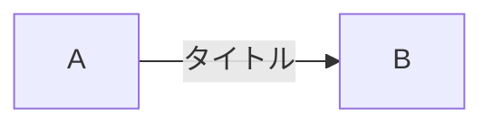

# 概要
> マーメイド(Mermaid)とは、マークダウン内で専用の記法を用いてグラフやチャートなどの図形を簡単に描くことができるJavascriptのライブラリのことです。また専用の記法をマーメイド記法と呼びます。

# 実装する内容

# 実装方法

基本的にはカラム名を矢印(-->)で繋ぐことによるフローチャートを記述する。

1. コードブロックでコードを囲む
2. 以下のように記述する

コードブロック内
```
タイトル
カラム名 -- 矢印コメント --> カラム名
```

# 実装例



# 参考資料
- [一度は試してほしい！シーケンス図を書くならマーメイド記法](https://qiita.com/espritfort_tech/items/bf30c88ad5638d7be622)


```kroki
mermaid
graph TD;
  Start --> Process;
  Process --> End;
```
