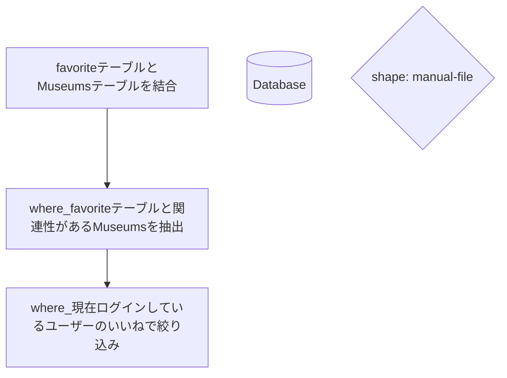
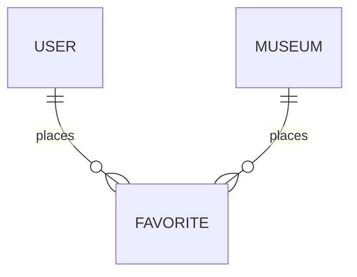
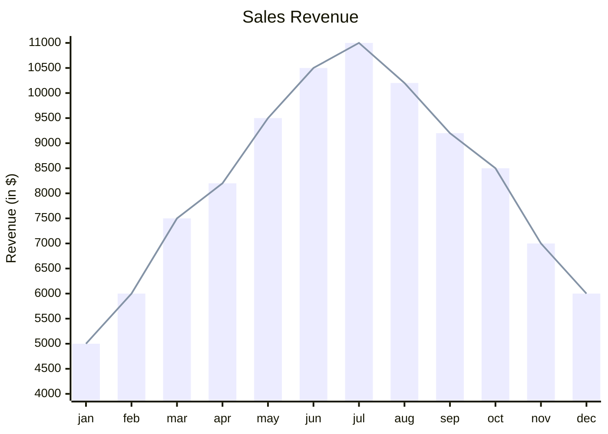

# 経緯
以下のコードがの意味がわからなかった。

``@museums = Museum.joins(:favorites).where(favorites: { user_id: current_user.id })``

```
  def favorited_museums
    @museums = Museum.joins(:favorites).where(favorites: { user_id: current_user.id })
    render :index  
  end
```

# 処理の流れ



## whereについて
複数のレコードを絞り込むメソッド。

モデル.where(テーブル名; {カラム: 値})




