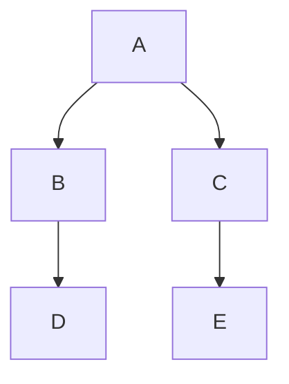

# Untracked Filesとは

Untracked filesとは、未追跡のファイルがあるということ。 「ステージング（git add）していないということ。」

# 確認方法
git statusで確認できる。

# 削除する方法
- git clean -nで内容をチェックできる
- git clean -fで``未追跡ファイル``を削除できる
- git clean -dで``未追跡ディレクトリ``を削除できる
- git clean -xで``未追跡ファイル(gitignoreに記載)``を削除できる
- ※gitignoreに記載されたファイルはgithubにプッシュされないので、基本的に未追跡ファイルとなる。

# 参考資料

- [git clean(アトラシアン) ](https://www.atlassian.com/ja/git/tutorials/undoing-changes/git-clean)
- [gitコマンドで、未追跡ファイルを一括削除](https://qiita.com/quzq/items/c1577f074f636ef5803a)
- [git clean」でプロジェクトの整理を！安全にきれいを保つ方法](https://envader.plus/article/375)

