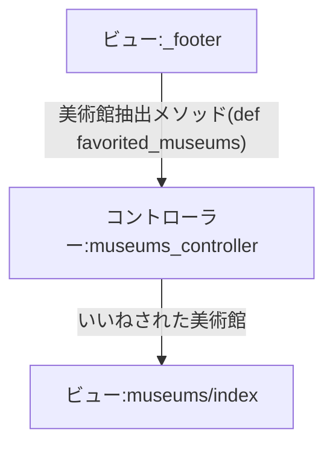

# 経緯
いいねした美術館の一覧を表示するように考えていた。

# 実装方針
museums/index画面に与えられているインスタンス変数(@museums)に制限をかけることで、いいねした対象の美術館のみを表示する。
ただし、Runsuckの処理により、@qに何も代入されない場合、全ての美術館が表示されることからこれを回避する実装とする。

# 処理の流れ



# 実装結果

<details>
<summary>実装したコード</summary>

>_footer.html.erb

```
    <%= button_to favorited_path, method: :get do %>
      <div><i class="fa-solid fa-heart fa-2x"></i></div>
      <div><span class="btm-nav-label">Favorites</span></div>
    <% end %>
```

> museums_controller.rb
```
  def favorited_museums
    @museums = Museum.joins(:favorites).where(favorites: { user_id: current_user.id })
    render :index  
  end
```

> route.rb 
```
  get '/favorited', to: 'museums#favorited_museums'
```

> museums/_search.html.erb
```
# ランサックの機能を停止する目的
<% if @q.present? %>
```

</details>

# 参考文献
- [chatGPT](https://chatgpt.com/share/676ac462-4558-8003-8eeb-4c11c6cb6a96)
