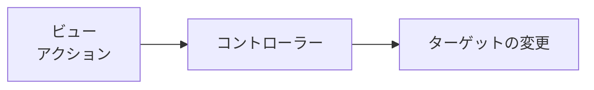

# 経緯
普段の学習アプリにて、Twitterへの学習時間・内容の投稿をおこなっている。現在、アプリにおいては、indexに``<script>``タグを用いてjavascriptを記載しているが、これをstimulusコントローラー化することを試みた。

## 処理の概略

ビューから発火したアクションにより、対象のコントローラーが起動しターゲットに指定したDOMに対して、処理が実行される。

## action
コントローラーが起動するアクションを指定する。

## target
コントローラーが対象とするDOMを指定する。

# 実装方針
## stimulus初期設定
- app/javascript/application.js

- ビュー側へのアクション、ターゲットの定義
- コントローラー側への処理の定義

# 実装内容

# 結果

# 参考資料
