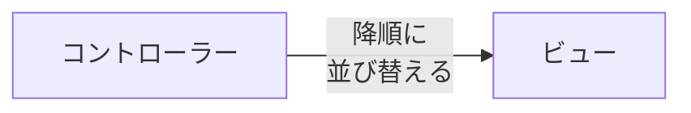

# 実装概要
各美術館のいいね数のランキングを作成する。

# 実装方針
- museumモデルのオブジェクトをいいねの数で降順に並び替えたものを出力する。
- ビューに表示する。



# 実際のコード
## コントローラー
同じカラムの値をもつレコードをグループ化し、それぞれのグループを特定の条件で並べ替えた後、それぞれのグループが持つ属性値を抽出する。
今回の場合、グループをpost_idのレコードが多い順番に並び替える。

- Like.group(:post_id):同じpost_idを持つレコードをグループ化する
- order('count(post_id)' desc):ポストidの数が多いグループを降順に並べる
- pluck(post_id)。それぞれのグループのpost_idを取り出す。

```
@post_like_ranks = Post.find(Like.group(:post_id).order('count(post_id) desc').pluck(:post_id))
```
## ビュー
daisyUIのテーブルテンプレートを使用する。
このテンプレートのヘッダー以下のビューをオブジェクトに対応して、eachで作成する。

<details>
<summary>テーブルテンプレート</summary>

```
<div class="overflow-x-auto">
  <table class="table">
    <!-- head -->
    <thead>
      <tr>
        <th></th>
        <th>Name</th>
        <th>Job</th>
        <th>Favorite Color</th>
      </tr>
    </thead>
    <tbody>
      <!-- row 1 -->
      <tr>
        <th>1</th>
        <td>Cy Ganderton</td>
        <td>Quality Control Specialist</td>
        <td>Blue</td>
      </tr>
      <!-- row 2 -->
      <tr>
        <th>2</th>
        <td>Hart Hagerty</td>
        <td>Desktop Support Technician</td>
        <td>Purple</td>
      </tr>
      <!-- row 3 -->
      <tr>
        <th>3</th>
        <td>Brice Swyre</td>
        <td>Tax Accountant</td>
        <td>Red</td>
      </tr>
    </tbody>
  </table>
</div>
```

</details>

# 実装結果
eachを用いて、@museumsの各オブジェクトについて、テーブル行の要素を生成した。

<details>

<summary>app/views/favorite_ranks/index.html.erb</summary>

```
<div class="overflow-x-auto">
  <table class="table">
    <!-- head -->
    <thead>
      <tr>
        <th></th>
        <th>Name</th>
        <th>Links</th>
      </tr>
    </thead>
    <tbody>
      <% @museum_favorite_ranks.each do |museum| %>
        <!-- row 1 -->
        <tr>
          <td><%= museum.id %></td>
          <td><%= museum.name %></td>
          <td><%= link_to "リンク", museum_path(museum) %></td>
        </tr>
      <% end %>
    </tbody>
  </table>
</div>
```

</details>

<details>

<summary>app/controllers/favorite_ranks_controller.rb</summary>

```
class FavoriteRanksController < ApplicationController
  def index
    @museum_favorite_ranks = Museum.find(Favorite.group(:museum_id).order('count(museum_id) desc').pluck(:museum_id))
  end
end
```

</details>

# 今後の課題
- N+1問題が発生している可能性があるので検証する。

# 参考資料
- [『Rails』 groupメソッドで、月毎のデータを取得する方法 #Ruby - Qiita](https://qiita.com/yuhi_taka/items/675aa9fa404ea32b6a0f)
- [カラムの値ごとにeach文を回す方法【Rails】 #初学者向け - Qiita](https://qiita.com/ysk91_engineer/items/4fc6bdccb173fd21a97b)
- [Ruby on Rails | コントローラの作成と命名規則(命名規約)](https://www.javadrive.jp/rails/controller/index1.html)
- [link_to をブロックで囲って each で回す方法(link_to do ~ end) #Ruby - Qiita](https://qiita.com/mmch0626/items/b35b43bee88cf6efa9dd)
- [ysk91_engineer - Qiita](https://qiita.com/ysk91_engineer)
