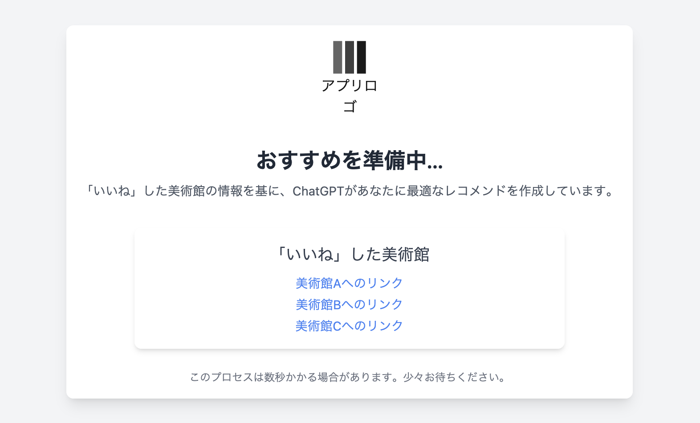

# 現状
chatGPTからの美術館レコメンド機能を実装している。以下の通りの状況となっている。

# 改善点
以下の通り列挙する。基本的にはみた目から改善をはかり余力があれば、他サイトと比較する。
- アプリロゴが表示されていない
- アプリロゴの文字が切れている
- いいねした美術館が列挙されていない
- なんの美術館かがわからない

比較・みた通りの問題点

# 改善方法

## アプリロゴが表示されていない
imgタグのsrc属性を対象のファイルに書き換える

## アプリロゴの文字が切れている
pタグの横幅を広げる？

## いいねした美術館が列挙されていない
ビューに渡されているオブジェクトをeachで展開する。この時、あまりに多いと煩雑な見た目となるのでlimitで表示を制限する。

## なんの美術館かがわからない
オブジェクトを展開する時にname属性を対象に値を取得する。

# 改善結果

## アプリロゴが表示されていない
上記の通り修正した。

## アプリロゴの文字が切れている
画像のパスが正しく当たっていないため、画像のalt属性が表示されていた。
よって、imgタグをrailsのimage_tagに置き換えた前提で、assets/images内のファイルを参照した。

## いいねした美術館が列挙されていない
現在のユーザーがいいねした美術館のオブジェクトコレクションを出力し、それぞれのオブジェクトに対して、mapにより属性を抽出した。

## なんの美術館かがわからない

## 今後の対応
現在のレコメンデーションに関して、根拠を表示するように修正する。

