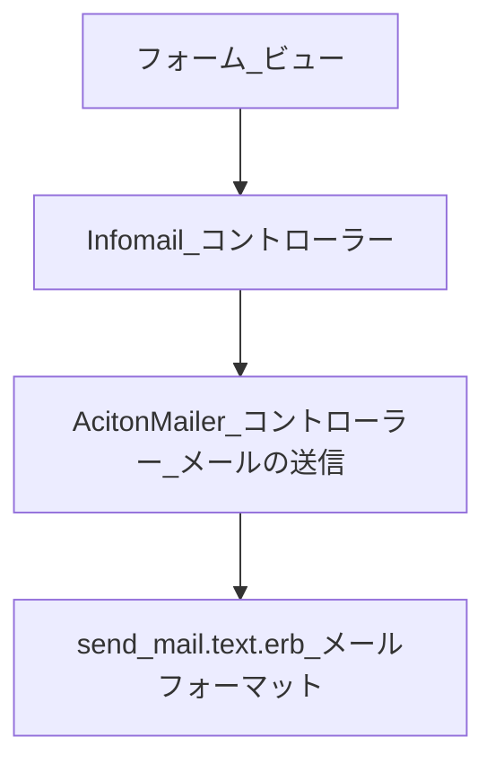

# 経緯


# 実装の流れ
Railsの機能の一つであるActionMailerを使用して、メール送信機能を実装する。

- モデルの作成
- Action Mailerの作成
- mailersファイルの編集
- プレビューによるメール内容の事前確認
- Gmailで送信するための設定
- 送信用

## Action Mailerとは

>Action Mailerを使うと、アプリケーションからメールを送信できるようになります。Action Mailerは、Railsフレームワークにおけるメール関連コンポーネントの1つであり、メール受信を処理するAction Mailboxと対になります。</br>

引用:railsガイド

## 処理の流れ
ビューから受け取った問い合わせ内容をコントローラーが受け取り、Actionmailerをへて送信する。コントローラーはビューから受け取った内容をオブジェクト化しデータベースに保存、メイン画面への遷移等を実行する。
<br>
(20250104記載)infomail_mailer.rbからメールを送信する。今回は受信者にもメールを送信したいので、メールを二通送るにはこれも２通り作成するのか？
メールの作成に用いるデータは送信者に送信したものと同じで良いと考えている。

| ファイル                           | MVC          | 役割                                                                   |
|------------------------------------|--------------|------------------------------------------------------------------------|
| infomail_mailer.rb                 | ActionMailer | コントローラーからフォームの入力内容を受け取り、</br>メールを送信する. |
| infomail_controller.rb             | Controller   | ビューからのデータ保存、メイン画面へリダイレクト、                     |
| new.html.erb                       | View         | ユーザーからの入力内容の受け取り                                       |
| infomail_mailer/send_mail.text.erb | View         | 送信メールの内容を示す                                                 |



# 実装結果

<details>
<summary>すべてのコード</summary>

> new.html.erb
```
<%= form_with(model: @infomail, local: true) do |f| %>
    <div class='form-wrap'>
      <div class='form-header'>
        <h5 class='form-header-text'>
          お問い合わせフォーム
        </h5>
      </div>
    </div>
    <div class="correct-msg-box">
      <% if @infomail.errors.any? %>
        <div id="error_explanation">
          <ul><% @infomail.errors.full_messages.each do |message| %>
            <li><%= message %></li>
            <% end %>
          </ul>
        </div>
      <% end %>
      <div class="correct-msg-main">
        <div class="infomail-form">
            <div class="correct-text-field">
              <%= f.label "お名前" %>
              <%= f.text_field :name, placeholder: "お名前", class: "input-form" %>
            </div>
            <div class="correct-text-field">
              <%= f.label "お問合せ内容" %>
              <%= f.text_area :content, placeholder: "お問合せ内容を入力してください", class: "input-form" %>
            </div>
            <div class="send-btn-contents">
              <div class="register-btn">
                <%= f.button type: "submit", class:"register-red-btn", style:'border-style: none;' do %> 
                  送信 <i class="fas fa-paper-plane"></i>
                <% end %>
              </div>
              <div class="register-btn">
                <%= link_to "もどる", root_path, class:"register-red-btn", style:"background-color: #aaa" %>
              </div>
            </div>
        </div>
      </div>
  </div>
<% end %>
```

> infomails_controller.rb
```
class InfomailsController < ApplicationController
  def new
    @infomail = Infomail.new
  end

  def create
    @infomail = Infomail.new(infomail_params)
    if @infomail.save
      InfomailMailer.send_mail(@infomail, current_user).deliver
      redirect_to root_path, notice: 'お問い合わせ内容を送信しました'
    else
      render :new
    end
  end

  private

  # Only allow a list of trusted parameters through.
  def infomail_params
    params.require(:infomail).permit(:name, :content)
  end
end
```

> app\mailers\infomail_mailer.rb
```
class InfomailMailer < ApplicationMailer
  def send_mail(infomail)
    @infomail = infomail
    mail(
      from: 'infouser@example.com',
      to:   'admin@example.com',
      subject: 'お問い合わせ通知'
    )
  end
end
```

> infomail_mailer/send_mail.text.erb
```
<%= @infomail.name %>様

  いつもご利用いただき誠に有難うございます。
  また、お問合せのメールを頂き誠に有難うございます。

  ===============================================

  【お問合せ内容】
  <%= @infomail.content %>

  ===============================================

  頂きましたお問合せ内容につきましては、内容を確認の上早急に対応致します。
  お時間少々頂戴できますと幸甚でございます。

  また、今後とも当アプリケーションをどうぞよろしくお願い申し上げます。

  --------------------
  運営事務局
  責任者： ○○
  E-mail: ○○@example.com
  電話番号：000-0000-0000
  住所：〒000-0000  東京都○○区△△町0-0-0
  --------------------
```
</details>

# 課題
- デザインの改善


# 参考資料
- [【Rails7】Windows ActionMailerを使ってGmailからメール送信してみよう【初心者用】](https://sumiox.com/rails-actionmailer-gmail/)
- [Rails7 Devise パスワードリセット機能](https://qiita.com/Erika328/items/ae4dde4e9f946eb08832)
- [【rails6】お問合せフォームの実装（メール送信を含む）](https://qiita.com/takapon21/items/bd2dd148ad6ae38238f4)
